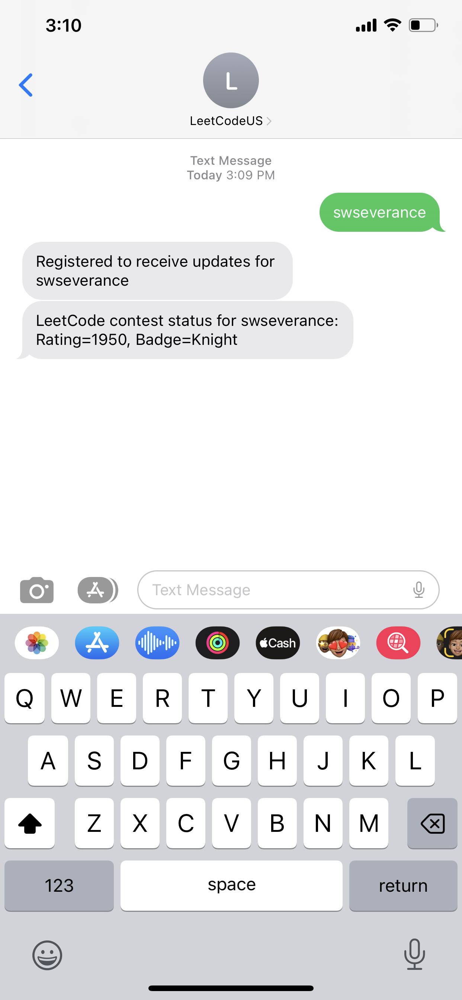

## Update

LeetCode has changed their API so that it is not publicly accessible like it once was. Unfortunately LeetCodeRatingsTexter is broken until further notice.

# LeetCodeRatingsTexter

Tired of repeatedly checking LeetCode to see if your contest rating has updated? Instead text your LeetCode username to **12622281809** and it will notify you the next time your rating is updated. You should receive an initial contest rating within 30 minutes of signing up.

## How does it work?

Text a LeetCode username to **12622281809** to register to receive contest rating updates via text message.

## Disclaimer

1. This is a side project that could stop working at any moment.
2. You might receive a text at 2:30 in the morning if that's when LeetCode updates your contest rating. You've been warned!
3. The only personal information I store is your phone number. You have my word that I will never sell this data or harvest it in any way and will take reasonable measures to keep it secure.
4. It currently does not work for LeetCode China users

## Open Questions

Does it work for non-US numbers?

Does texting "STOP" cause the updates to discontinue?

## Implementation

Azure functions and Twilio
